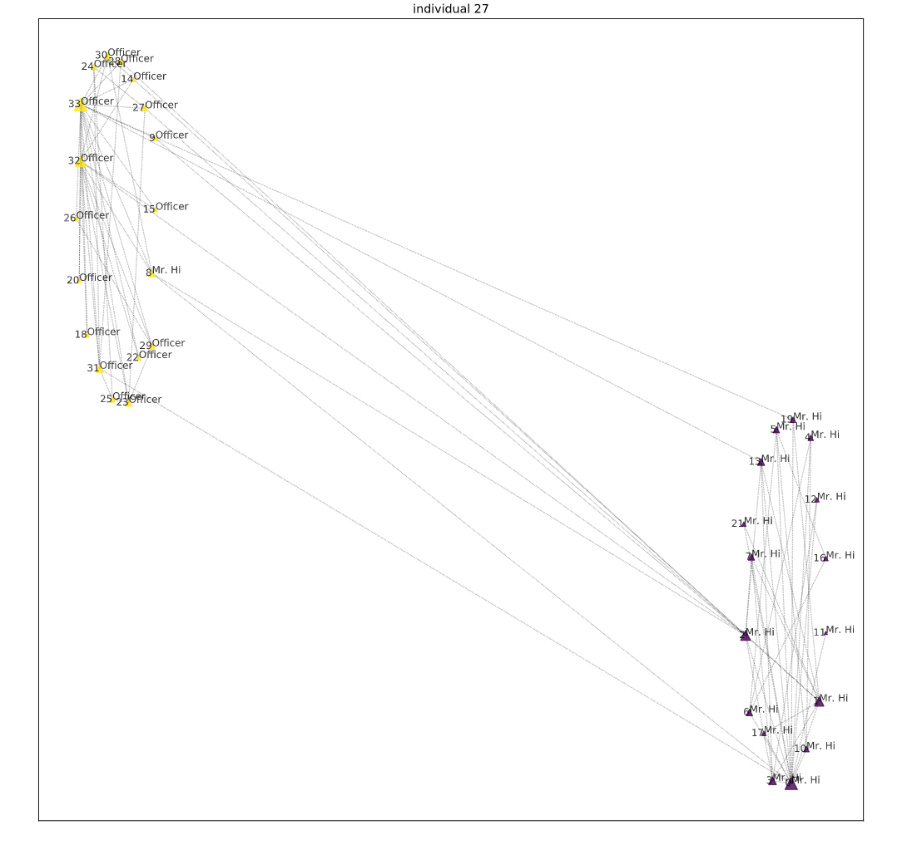
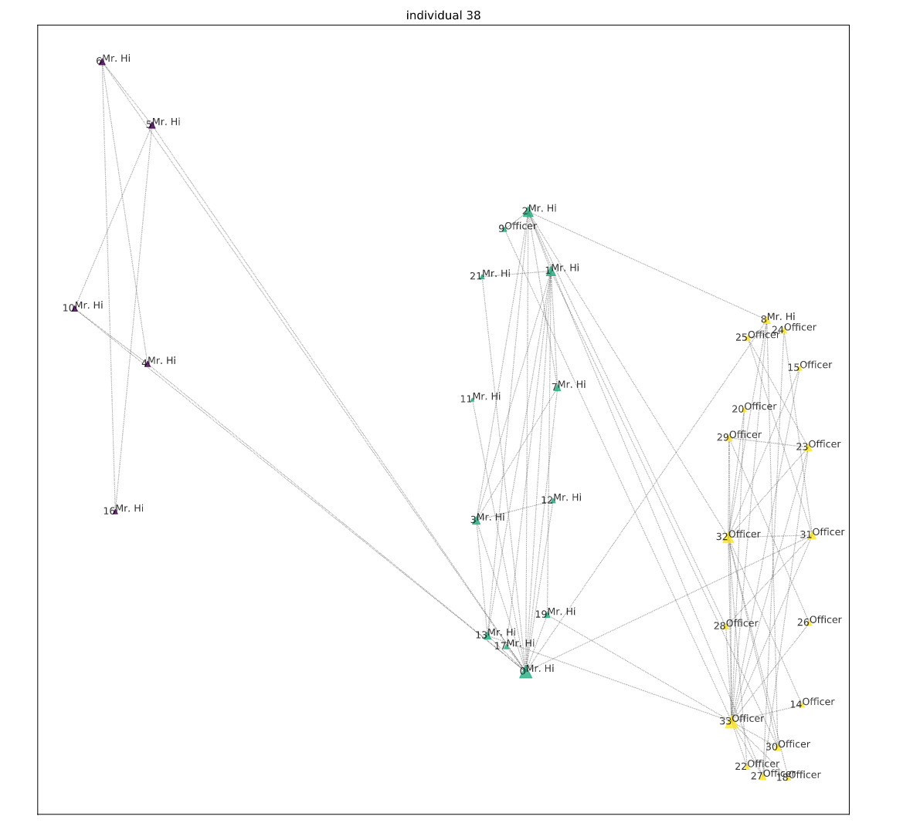

# MODEA
算法复现 Complex network clustering by multiobjective discrete particle swarm optimization based on decomposition

使用karate club的网络进行测试，在进行小规模的迭代后得到最优modularity是0.40203813280736356
最优NMI是 0.8371694628777809，和原文的相差不大，由于个人计算机的原因，有可能是迭代次数不够导致（而且我也并没有真的做过很长时间的实验。。。）

如果使用default的参数，最后会生成10张KKM和RC优化图，按顺序代表每一次迭代的优化
还有最后一次优化每个individual的modularity数值

由于同时出现了很多的最优值，会随意画出两个最优modularity和最优NMI的分布图

Qmax:0.40203813280736356

NMImax:0.8371694628777809
